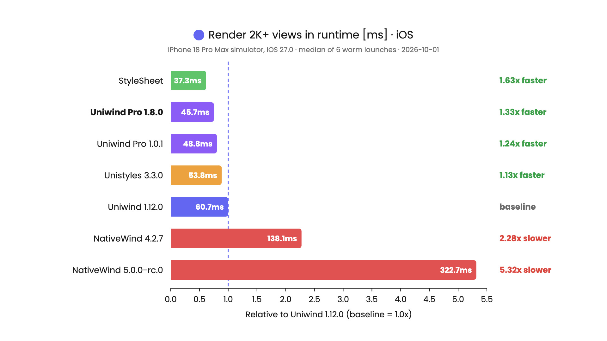
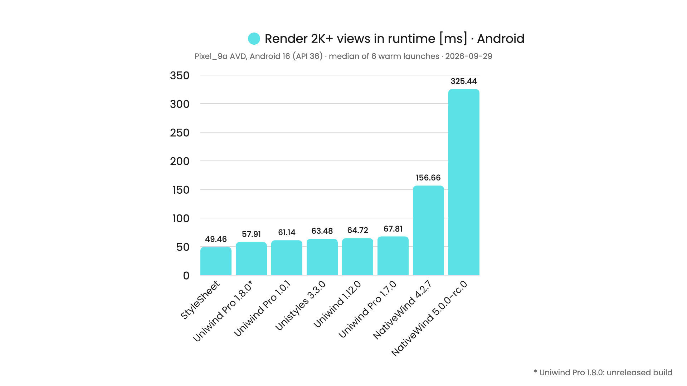
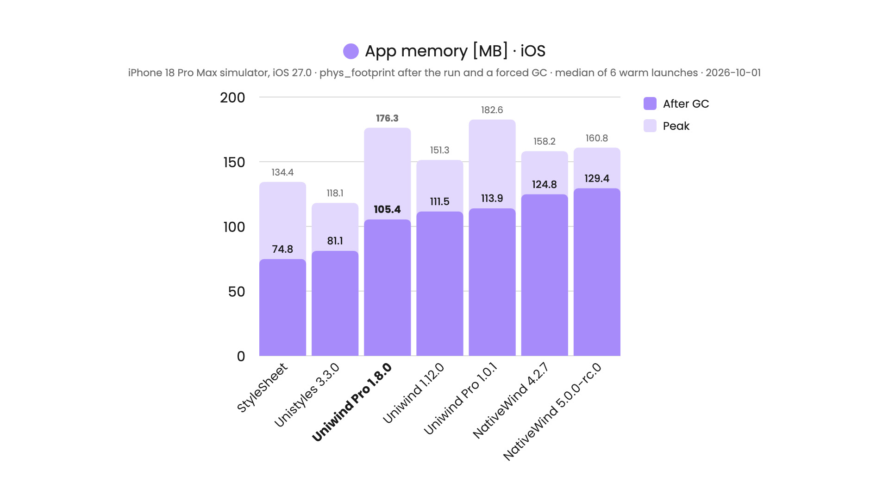
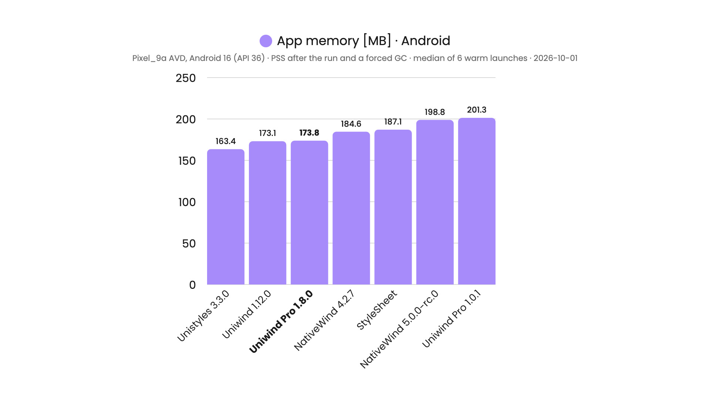

# Uniwind Benchmarks

Benchmark repository for different React Native styling libraries.





## Methodology

Every app renders the same screen: a header card plus a grid of 1000 items (2003 views in total), re-rendered 10 times.
The app shows the average render time of those 10 runs, in milliseconds.

- Release builds, Hermes, New Architecture, React Native 0.86.3 bare apps (Expo SDK 57 for NativeWind 5)
- iOS: iPhone 18 Pro Max simulator (iOS 27.0). Android: Pixel_9a AVD (Android 16, API 36, arm64, 4 GB RAM)
- Warm launches only: after installing an app, the first (cold) launch is discarded, then the app is terminated and relaunched 3 times
- Memory is read from outside the app after the result, so it does not affect the timing
- Uniwind, Uniwind Pro and NativeWind use the exact same classNames

It’s difficult to directly compare Unistyles, Uniwind, and Nativewind to StyleSheet, as it has no features, it only serves as a baseline for performance.


### Memory

Memory of the app after the benchmark (2003 views mounted, after a forced GC), in MB (MiB). Peak is the highest iOS
footprint during the run.





## Uniwind Pro versions

All Uniwind Pro versions are measured with the same `uniwind-pro` app; only the `uniwind` dependency changes.
`scripts/use-pro.sh <version>` switches it (package.json, `bun install`, `pod install`). The committed app is pinned to
the latest published release, 1.7.0. There is no `uniwind-pro@1.0.0` on npm, 1.0.1 is the first stable release.

Uniwind Pro 1.8.0 is not published yet; it is the upcoming release. It was measured from uniwind-pro `main` at `e210e4c5`
(which includes the `perf/lean-host-props` and `feature/glitches` work), built like the release workflow
(`bun install --linker hoisted`, `bun run build`, `npm pack`) with the version set to 1.8.0. To reproduce, pack a build
and run `UNIWIND_PRO_TARBALL=/path/to/uniwind-pro-1.8.0.tgz scripts/use-pro.sh 1.8.0`. Uniwind Pro 1.7.0 was dropped from
the benchmark.

This benchmark mounts 2003 fresh views on every run. It does not exercise style updates, theme changes or animations,
which is where the newer Uniwind Pro releases moved work off the JavaScript thread.

## Repository Structure

```
uniwind-benchmarks/
├── apps/                    # React Native applications
│   ├── nativewind4/        # NativeWind v4 benchmark app
│   ├── nativewind5/        # NativeWind v5 benchmark app (Expo)
│   ├── stylesheet/         # React Native StyleSheet benchmark app
│   ├── unistyles3/         # Unistyles v3 benchmark app
│   ├── uniwind/            # Uniwind benchmark app
│   └── uniwind-pro/        # Uniwind Pro benchmark app (version set by scripts/use-pro.sh)
├── packages/
│   └── benchmark/          # Shared benchmark utilities
├── patches/                # bun patches (react-native-css-interop Expo detection in a bare app)
├── results/                # Measured numbers of the current round (results.json)
├── scripts/                # Chart generator, Uniwind Pro version switcher
├── biome.json              # Biome configuration (linting + formatting)
├── tsconfig.json           # TypeScript configuration
└── package.json            # Workspace root configuration
```

## Running the benchmarks

```sh
bun install
# iOS (from an app directory)
cd apps/stylesheet/ios && pod install && cd .. && bun run ios -- --mode Release
# Android
bun run android -- --mode release
# NativeWind 5 (Expo)
cd apps/nativewind5 && bunx expo run:ios --configuration Release
# Switch the Uniwind Pro app to another version (then `./gradlew clean` before an Android build)
scripts/use-pro.sh 1.0.1
# Regenerate the charts from results/results.json (requires Google Chrome and ImageMagick)
node scripts/generate-chart.mjs
node scripts/generate-memory-chart.mjs   # assets/memory*.jpg; --sample previews the look with made-up values
```

Uniwind Pro requires a license; `bun install` downloads the package through the Uniwind Pro CLI credentials.

## Re-measuring a library

`scripts/bench/` re-measures one or more libraries with the method above and merges the numbers into
`results/results.json` and the charts. The configs (ids as in `results.json`, app, bundle ids,
Pro version) live in `scripts/bench/configs.json`. The charts are generated from `results.json`, do not edit them by hand.

Prerequisites: Xcode with the iOS 27 simulator runtime (iPhone 18 Pro Max), the Android SDK with the Pixel_9a AVD
(Android 16, arm64), the [argent](https://www.npmjs.com/package/@swmansion/argent) CLI (`npm i -g @swmansion/argent`,
it launches the iOS apps and reads their result), Google Chrome and ImageMagick for the charts, a Uniwind Pro license
for Pro configs, and a quiet host: stop other builds, test runs and heavy apps (every launch waits for a load average below 6).

Example: Uniwind Pro 1.8.0 once it is published on npm.

```sh
bun install
scripts/use-pro.sh 1.8.0                 # npm:uniwind-pro@1.8.0, bun install, pod install, verifies the version
scripts/bench/build.sh stylesheet        # once: the StyleSheet control app used in every block
scripts/bench/build.sh pro-1.8.0         # Release .app and .apk into .bench/artifacts/, logs in .bench/logs/

# iOS simulator (`xcrun simctl list devices` shows the UDID)
xcrun simctl boot <udid>
# Android emulator: windowless, started from bash, 4 GB RAM (see below)
/bin/bash -c '"$HOME/Library/Android/sdk/emulator/emulator" -avd Pixel_9a -no-snapshot-load -no-audio -memory 4096 -no-window -gpu host > /tmp/emulator.log 2>&1 &'
adb wait-for-device shell 'while [ "$(getprop sys.boot_completed)" != 1 ]; do sleep 2; done'

scripts/bench/measure.py ios <udid> pro-1.8.0
scripts/bench/measure.py android emulator-5554 pro-1.8.0
node scripts/bench/update-results.mjs .bench/runs/<date>-ios.json .bench/runs/<date>-android.json
git diff                                 # review, then commit
```

- The emulator flags matter: macOS App Nap throttles an emulator whose window is hidden (about 6x slower), zsh `&`
  starts it at nice +5, and the AVD's `config.ini` asks for 2 GB, which swaps under this benchmark.
  `measure.py` refuses to start when the emulator threads run at a lowered priority. If `adb devices` shows the
  emulator as `unauthorized`, boot it once with `-wipe-data`.
- `build.sh` never switches Uniwind Pro versions; it fails when the installed version does not match the id. It always
  cleans the Android build, because the React Native bundle task would otherwise reuse a stale JS bundle. For NativeWind 5
  it runs `expo prebuild` when the native projects are missing and re-applies the iOS 27 scene patch
  (`scripts/bench/scene-patch.py`, also needed after every `expo prebuild --clean`).
- `measure.py` defaults to 2 sweeps (forward, reverse) of 3 warm launches (`--sweeps`, `--launches`). StyleSheet controls
  are compared with the StyleSheet median in `results.json`, so other libraries do not need to be re-measured;
  `--rebaseline` measures StyleSheet first instead. Every launch, block and control reading goes to `.bench/runs/`.
- `update-results.mjs` computes ratios against the StyleSheet medians in `results.json`, replaces the numbers of the
  measured configs (`results.json` holds the current round only), takes version and label from the measured build (a published version clears the `unreleased` flag and note)
  and regenerates the tables and charts. It refuses when the StyleSheet controls drifted more than 5% from the StyleSheet
  median; `--allow-drift` merges anyway and records a normalized value too. `--dry-run` prints the merged JSON only.
- If one config's block drifted, re-measure only that config (`measure.py <platform> <device> <id> --rebaseline --out …`) and
  pass both run files; a config measured in several files takes the last file's numbers. `--skip-memory <platform>` merges
  the timing without that platform's memory.
- `measure.py` reads memory on every launch, including the StyleSheet controls, and prints a memory summary next to
  the timing one (`--memory-settle` sets the wait after the GC signal). `update-results.mjs` stores it under
  `<platform>.memory` in `results.json` and generates the memory charts.
- The config drawn in bold in the charts is `highlight` in `scripts/bench/configs.json` (default: the latest `uniwind` version).
- Still manual: the prose above (for example the Uniwind Pro versions section).
- A new Uniwind Pro version needs an entry in `scripts/bench/configs.json` (copy `pro-1.8.0`, change `id` and `pro.version`).
