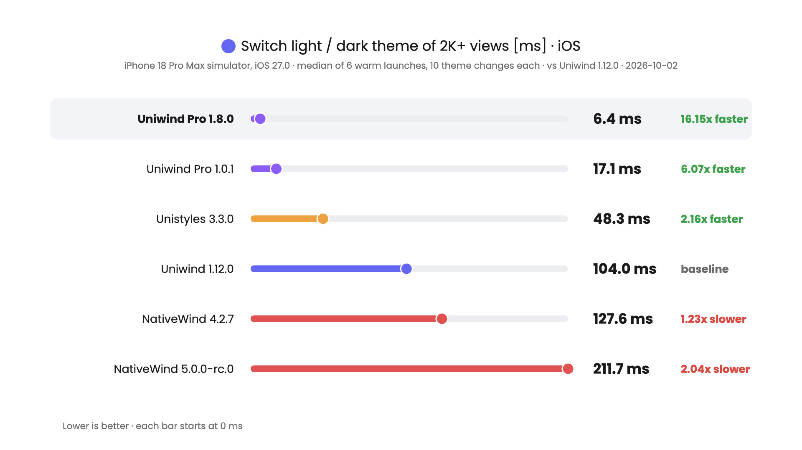
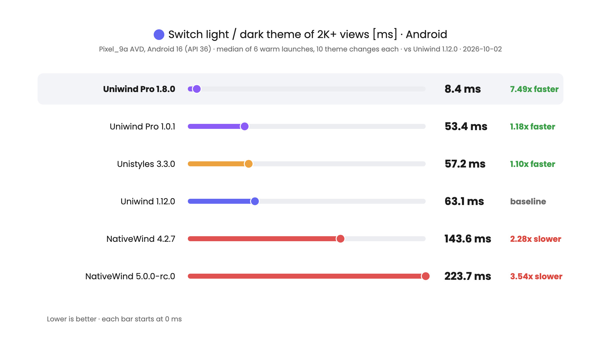

# Uniwind Benchmarks

Benchmark repository for different React Native styling libraries.

### Render 2K+ views


### Change the theme of 2K+ views





## Methodology

Every app renders the same screen: a header card plus a grid of 1000 items (2003 views in total), re-rendered 10 times.
The app shows the average render time of those 10 runs, in milliseconds. The theme change benchmark uses the same
screen, see [Theme change](#theme-change).

- Release builds, Hermes, New Architecture, React Native 0.86.3 bare apps (Expo SDK 57 for NativeWind 5)
- iOS: iPhone 18 Pro Max simulator (iOS 27.0). Android: Pixel_9a AVD (Android 16, API 36, arm64, 4 GB RAM)
- Warm launches only: after installing an app, the first (cold) launch is discarded, then the app is terminated and relaunched 3 times
- Memory is read from outside the app after the result, so it does not affect the timing
- Uniwind, Uniwind Pro and NativeWind use the exact same classNames

It’s difficult to directly compare Unistyles, Uniwind, and Nativewind to StyleSheet, as it has no features, it only serves as a baseline for performance.


### Memory

Memory of the app after the benchmark (2003 views mounted, after a forced GC), in MB (MiB). Peak is the highest iOS
footprint during the run.


### Theme change

The same screen, mounted once, then switched between the light and dark theme 10 times (dark, light, dark, ...).
Every change is timed from the theme switch until the JavaScript thread is idle again, the app shows the average.
Every library uses its own way to change the theme:

- Unistyles: `UnistylesRuntime.setTheme` (adaptive themes off)
- Uniwind, Uniwind Pro: `Uniwind.setTheme`
- NativeWind 4: `colorScheme.set`, NativeWind 5: `Appearance.setColorScheme`. Both re-render when React Native reports the new color scheme, so the measurement waits for that event before it waits for idle

Unistyles and Uniwind Pro update the views from C++ without re-rendering React components, Uniwind and NativeWind re-render every styled component. StyleSheet has no themes, so it is not part of these charts. Each value is the median of 6 warm launches (10 theme changes each).


## Running the benchmarks

```sh
bun install
# iOS (from an app directory)
cd apps/stylesheet/ios && pod install && cd .. && bun run ios -- --mode Release
# Android
bun run android -- --mode release
# NativeWind 5 (Expo)
cd apps/nativewind5 && bunx expo run:ios --configuration Release
# Switch the Uniwind Pro app to another version (then `./gradlew clean` before an Android build)
scripts/use-pro.sh 1.0.1
# Regenerate the charts from results/results.json (requires Google Chrome and ImageMagick)
node scripts/generate-chart.mjs           # render charts, theme charts once measured, README tables
node scripts/generate-memory-chart.mjs   # assets/memory*.jpg; --sample previews the look with made-up values
```

Uniwind Pro requires a license; `bun install` downloads the package through the Uniwind Pro CLI credentials.

### Re-measuring

The pipeline lives in `scripts/bench` (configs in `configs.json`, artifacts and raw runs in the gitignored `.bench/`).
One build serves both scenarios, the theme scenario is picked with a launch argument.

```sh
scripts/bench/build.sh <id>                                   # Release .app / .apk, e.g. uniwind, pro-1.8.0
scripts/bench/measure.py ios <udid> <id...>                   # render scenario (and memory)
scripts/bench/measure.py ios <udid> <id...> --scenario theme  # theme scenario, every id except stylesheet
scripts/bench/measure.py android <serial> <id...> [--scenario theme]
node scripts/bench/update-results.mjs .bench/runs/<run>.json  # results.json, README tables and charts
```

The theme app is launched with `-benchmarkScenario theme` on iOS (`xcrun simctl launch`) and with the VIEW intent data
`uwbench://theme` on Android. A plain launch runs the render scenario.