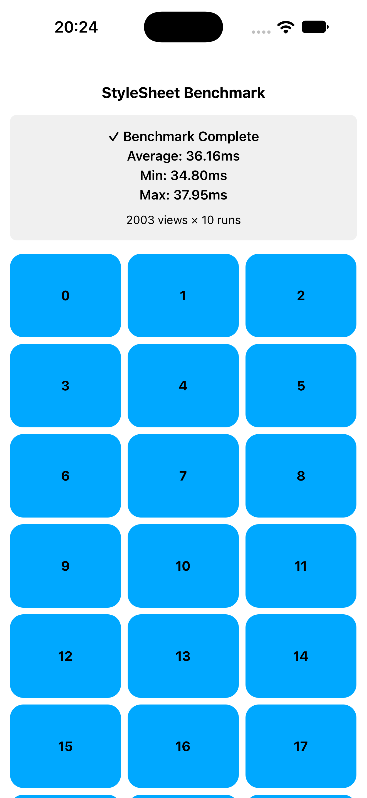
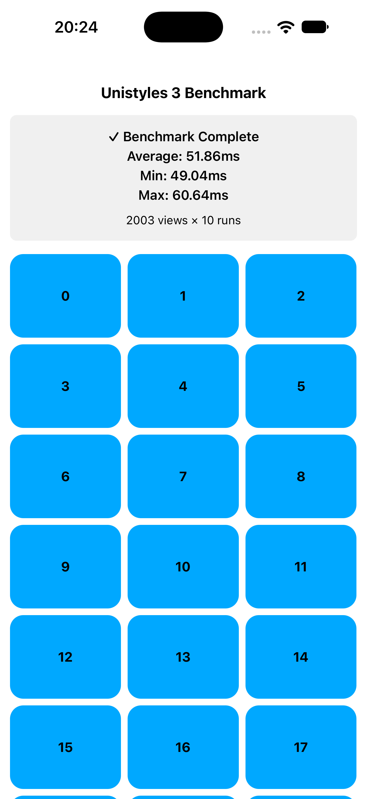
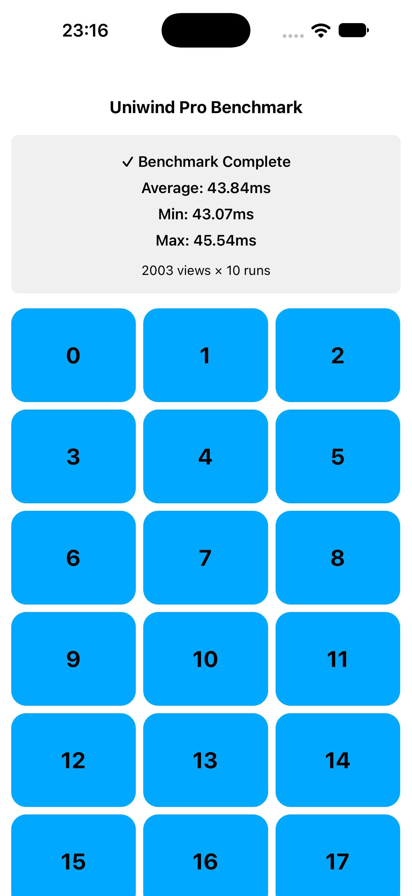
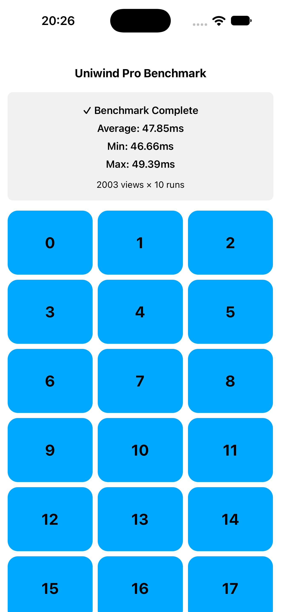
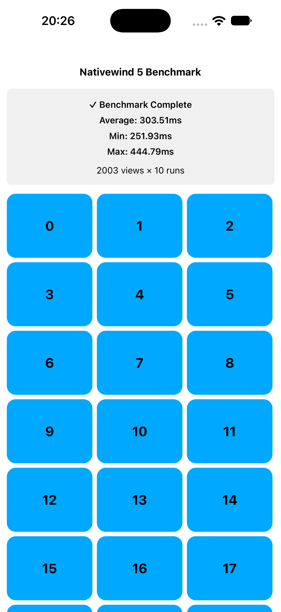

# Uniwind Benchmarks

Benchmark repository for different React Native styling libraries.


## Methodology

Every app renders the same screen: a header card plus a grid of 1000 items (2003 views in total), re-rendered 10 times.
The app shows the average render time of those 10 runs, in milliseconds.

- Release builds, Hermes, New Architecture, React Native 0.86.3 bare apps (Expo SDK 57 for NativeWind 5).
- iOS: iPhone 18 Pro Max simulator (iOS 27.0). Android: Pixel_9a AVD (Android 16, API 36, arm64, 4 GB RAM).
  Both on the same Apple M3 Pro Mac (macOS 27.0). Simulator/emulator numbers are only comparable with each other,
  not with the physical-device numbers from earlier revisions of this README.
- iOS 27 requires the scene lifecycle, so every iOS app starts React Native from a `SceneDelegate`.
- Warm launches only: after installing an app, the first (cold) launch is discarded, then the app is terminated and relaunched 3 times.
- Two sweeps over all libraries, one in forward and one in reverse order, so 6 warm launches per library.
  The reported value is the median of those 6.
- A StyleSheet control launch runs before and after every block. A block counts only if both controls are within 20%
  of the session's StyleSheet baseline. Every launch waits until the host's 1-minute load average is below 6.
- The Android emulator runs windowless (`-no-window -gpu host -memory 4096`). macOS App Nap throttles an emulator whose
  window is hidden, which made it about 6x slower; those runs were discarded.
- The result is read from the screen once, 10 seconds after launch. Inspecting the view hierarchy while the benchmark
  is running slows the render loop massively.
- Memory is read from outside the app after the result, so it does not affect the timing. The app gets a memory warning
  first (iOS: Simulate Memory Warning, Android: `am send-trim-memory RUNNING_CRITICAL`), which React Native answers with a
  full Hermes GC; 4 seconds later the reading is taken. Without the GC the number depends on when the last collection ran
  (about ±20 MB). iOS reports `phys_footprint` (the Xcode memory gauge, what the OS uses to terminate apps) and its peak
  during the run, Android the `TOTAL PSS` of `dumpsys meminfo`. The reported value is the median of the same 6 warm launches.
  Simulator/emulator memory is not the memory of a phone; compare the libraries with each other and with StyleSheet.

Uniwind, Uniwind Pro and NativeWind use the exact same classNames.

It’s difficult to directly compare Unistyles, Uniwind, and Nativewind to StyleSheet, as it has no features, it only serves as a baseline for performance.

## Results

Measured on 2026-10-01.

iOS

<!-- results:ios -->
| Library | Time [ms] | vs Uniwind 1.12.0 | Relative to StyleSheet |
| --- | --- | --- | --- |
| StyleSheet | 37.28 | 1.63x faster | 1.00 |
| **Uniwind Pro 1.8.0 (unreleased, built from main)** | 45.66 | 1.33x faster | 1.22 |
| Uniwind Pro 1.0.1 | 48.77 | 1.24x faster | 1.31 |
| Unistyles 3.3.0 | 53.81 | 1.13x faster | 1.44 |
| Uniwind 1.12.0 | 60.70 | baseline | 1.63 |
| NativeWind 4.2.7 | 138.12 | 2.28x slower | 3.70 |
| NativeWind 5.0.0-rc.0 | 322.69 | 5.32x slower | 8.66 |
<!-- /results:ios -->

Android

<!-- results:android -->
| Library | Time [ms] | vs Uniwind 1.12.0 | Relative to StyleSheet |
| --- | --- | --- | --- |
| StyleSheet | 59.95 | 1.31x faster | 1.00 |
| **Uniwind Pro 1.8.0 (unreleased, built from main)** | 67.54 | 1.16x faster | 1.13 |
| Uniwind Pro 1.0.1 | 72.00 | 1.09x faster | 1.20 |
| Unistyles 3.3.0 | 75.16 | 1.04x faster | 1.25 |
| Uniwind 1.12.0 | 78.24 | baseline | 1.31 |
| NativeWind 4.2.7 | 174.80 | 2.23x slower | 2.92 |
| NativeWind 5.0.0-rc.0 | 367.51 | 4.70x slower | 6.13 |
<!-- /results:android -->

Uniwind's Android blocks ran during a spike in host load: their StyleSheet controls were 6% above the StyleSheet median,
so its 78.24 ms is probably a little high (scaled by the controls it would be 73.84 ms, kept in `results/results.json`).

### Memory

Memory of the app after the benchmark (2003 views mounted, after a forced GC), in MB (MiB). Peak is the highest iOS
footprint during the run.


iOS

<!-- memory:ios -->
| Library | Memory [MB] | vs StyleSheet [MB] | Peak [MB] |
| --- | --- | --- | --- |
| StyleSheet | 74.8 | baseline | 134.4 |
| Unistyles 3.3.0 | 81.1 | +6.3 | 118.1 |
| **Uniwind Pro 1.8.0 (unreleased, built from main)** | 105.4 | +30.7 | 176.3 |
| Uniwind 1.12.0 | 111.5 | +36.8 | 151.3 |
| Uniwind Pro 1.0.1 | 113.9 | +39.2 | 182.6 |
| NativeWind 4.2.7 | 124.8 | +50.0 | 158.2 |
| NativeWind 5.0.0-rc.0 | 129.4 | +54.7 | 160.8 |
<!-- /memory:ios -->

Android

<!-- memory:android -->
| Library | Memory [MB] | vs StyleSheet [MB] |
| --- | --- | --- |
| Unistyles 3.3.0 | 163.4 | -23.6 |
| Uniwind 1.12.0 | 173.1 | -14.0 |
| **Uniwind Pro 1.8.0 (unreleased, built from main)** | 173.8 | -13.3 |
| NativeWind 4.2.7 | 184.6 | -2.5 |
| StyleSheet | 187.1 | baseline |
| NativeWind 5.0.0-rc.0 | 198.8 | +11.8 |
| Uniwind Pro 1.0.1 | 201.3 | +14.3 |
<!-- /memory:android -->

On Android, StyleSheet comes out above most styling libraries, entirely in the native heap. The readings repeat within a
few MB, but PSS also counts native memory the allocator keeps after the GC, so treat small Android differences with care;
the native heap, Java heap and code breakdown per library is in `results/results.json`.

Raw numbers, including every accepted warm launch and the spread per library, live in [`results/results.json`](./results/results.json).
Earlier rounds are kept in its `history` section. Charts are generated from that file with `node scripts/generate-chart.mjs`.

Screenshots below come from separate confirmation launches on iOS, so their numbers differ slightly from the medians above.









## Uniwind Pro versions

All Uniwind Pro versions are measured with the same `uniwind-pro` app; only the `uniwind` dependency changes.
`scripts/use-pro.sh <version>` switches it (package.json, `bun install`, `pod install`). The committed app is pinned to
the latest published release, 1.7.0. There is no `uniwind-pro@1.0.0` on npm, 1.0.1 is the first stable release.

Uniwind Pro 1.8.0 is not published yet; it is the upcoming release. It was measured from uniwind-pro `main` at `e210e4c5`
(which includes the `perf/lean-host-props` and `feature/glitches` work), built like the release workflow
(`bun install --linker hoisted`, `bun run build`, `npm pack`) with the version set to 1.8.0. To reproduce, pack a build
and run `UNIWIND_PRO_TARBALL=/path/to/uniwind-pro-1.8.0.tgz scripts/use-pro.sh 1.8.0`. Uniwind Pro 1.7.0 was dropped from
the benchmark; its last numbers are kept in the `history` section of `results/results.json`.

This benchmark mounts 2003 fresh views on every run. It does not exercise style updates, theme changes or animations,
which is where the newer Uniwind Pro releases moved work off the JavaScript thread.

## Repository Structure

```
uniwind-benchmarks/
├── apps/                    # React Native applications
│   ├── nativewind4/        # NativeWind v4 benchmark app
│   ├── nativewind5/        # NativeWind v5 benchmark app (Expo)
│   ├── stylesheet/         # React Native StyleSheet benchmark app
│   ├── unistyles3/         # Unistyles v3 benchmark app
│   ├── uniwind/            # Uniwind benchmark app
│   └── uniwind-pro/        # Uniwind Pro benchmark app (version set by scripts/use-pro.sh)
├── packages/
│   └── benchmark/          # Shared benchmark utilities
├── patches/                # bun patches (react-native-css-interop Expo detection in a bare app)
├── results/                # Measured numbers (results.json, current round + history)
├── scripts/                # Chart generator, Uniwind Pro version switcher
├── biome.json              # Biome configuration (linting + formatting)
├── tsconfig.json           # TypeScript configuration
└── package.json            # Workspace root configuration
```

## Running the benchmarks

```sh
bun install
# iOS (from an app directory)
cd apps/stylesheet/ios && pod install && cd .. && bun run ios -- --mode Release
# Android
bun run android -- --mode release
# NativeWind 5 (Expo)
cd apps/nativewind5 && bunx expo run:ios --configuration Release
# Switch the Uniwind Pro app to another version (then `./gradlew clean` before an Android build)
scripts/use-pro.sh 1.0.1
# Regenerate the charts from results/results.json (requires Google Chrome and ImageMagick)
node scripts/generate-chart.mjs
node scripts/generate-memory-chart.mjs   # assets/memory*.jpg; --sample previews the look with made-up values
```

Uniwind Pro requires a license; `bun install` downloads the package through the Uniwind Pro CLI credentials.

## Re-measuring a library

`scripts/bench/` re-measures one or more libraries with the method above and merges the numbers into
`results/results.json`, the tables above and the charts. The configs (ids as in `results.json`, app, bundle ids,
Pro version) live in `scripts/bench/configs.json`. The result tables are generated from `results.json`
(between the `<!-- results:* -->` markers), do not edit them by hand.

Prerequisites: Xcode with the iOS 27 simulator runtime (iPhone 18 Pro Max), the Android SDK with the Pixel_9a AVD
(Android 16, arm64), the [argent](https://www.npmjs.com/package/@swmansion/argent) CLI (`npm i -g @swmansion/argent`,
it launches the iOS apps and reads their result), Google Chrome and ImageMagick for the charts, a Uniwind Pro license
for Pro configs, and a quiet host: stop other builds, test runs and heavy apps (every launch waits for a load average below 6).

Example: Uniwind Pro 1.8.0 once it is published on npm.

```sh
bun install
scripts/use-pro.sh 1.8.0                 # npm:uniwind-pro@1.8.0, bun install, pod install, verifies the version
scripts/bench/build.sh stylesheet        # once: the StyleSheet control app used in every block
scripts/bench/build.sh pro-1.8.0         # Release .app and .apk into .bench/artifacts/, logs in .bench/logs/

# iOS simulator (`xcrun simctl list devices` shows the UDID)
xcrun simctl boot <udid>
# Android emulator: windowless, started from bash, 4 GB RAM (see below)
/bin/bash -c '"$HOME/Library/Android/sdk/emulator/emulator" -avd Pixel_9a -no-snapshot-load -no-audio -memory 4096 -no-window -gpu host > /tmp/emulator.log 2>&1 &'
adb wait-for-device shell 'while [ "$(getprop sys.boot_completed)" != 1 ]; do sleep 2; done'

scripts/bench/measure.py ios <udid> pro-1.8.0
scripts/bench/measure.py android emulator-5554 pro-1.8.0
node scripts/bench/update-results.mjs .bench/runs/<date>-ios.json .bench/runs/<date>-android.json
git diff                                 # review, then commit
```

- The emulator flags matter: macOS App Nap throttles an emulator whose window is hidden (about 6x slower), zsh `&`
  starts it at nice +5, and the AVD's `config.ini` asks for 2 GB, which swaps under this benchmark.
  `measure.py` refuses to start when the emulator threads run at a lowered priority. If `adb devices` shows the
  emulator as `unauthorized`, boot it once with `-wipe-data`.
- `build.sh` never switches Uniwind Pro versions; it fails when the installed version does not match the id. It always
  cleans the Android build, because the React Native bundle task would otherwise reuse a stale JS bundle. For NativeWind 5
  it runs `expo prebuild` when the native projects are missing and re-applies the iOS 27 scene patch
  (`scripts/bench/scene-patch.py`, also needed after every `expo prebuild --clean`).
- `measure.py` defaults to 2 sweeps (forward, reverse) of 3 warm launches (`--sweeps`, `--launches`). StyleSheet controls
  are compared with the StyleSheet median in `results.json`, so other libraries do not need to be re-measured;
  `--rebaseline` measures StyleSheet first instead. Every launch, block and control reading goes to `.bench/runs/`.
- `update-results.mjs` computes ratios against the StyleSheet medians in `results.json`, keeps the replaced numbers under
  `previous`, takes version and label from the measured build (a published version clears the `unreleased` flag and note)
  and regenerates the tables and charts. It refuses when the StyleSheet controls drifted more than 5% from the StyleSheet
  median; `--allow-drift` merges anyway and records a normalized value too. `--dry-run` prints the merged JSON only.
- If one config's block drifted, re-measure only that config (`measure.py <platform> <device> <id> --rebaseline --out …`) and
  pass both run files; a config measured in several files takes the last file's numbers. `--skip-memory <platform>` merges
  the timing without that platform's memory.
- `measure.py` reads memory on every launch, including the StyleSheet controls, and prints a memory summary next to
  the timing one (`--memory-settle` sets the wait after the GC signal). `update-results.mjs` stores it under
  `<platform>.memory` in `results.json` and generates the memory tables; their "vs StyleSheet" column needs the
  StyleSheet entry measured with memory, so do a full round once.
- The config drawn in bold in the charts is `highlight` in `scripts/bench/configs.json` (default: the latest `uniwind` version).
- Still manual: the "Measured on" date and the prose above (for example the Uniwind Pro versions section) and the screenshots.
- A new Uniwind Pro version needs an entry in `scripts/bench/configs.json` (copy `pro-1.8.0`, change `id` and `pro.version`).
